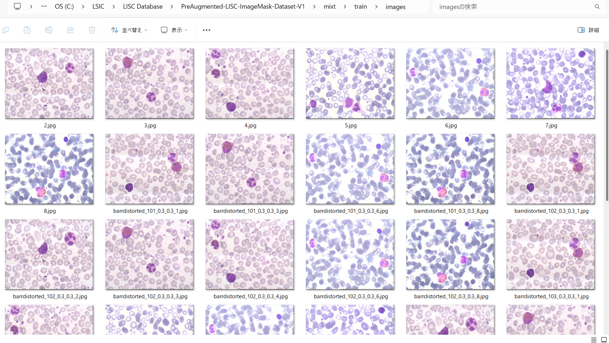

<h2>ImageMask-Dataset-LISC (2024/07/24) </h3>

This is PreAugmented LISC (Leukocyte) ImageMaskDatatset for Imae Segmentation. 

The original dataset used here has been take from the following web-site. 

<a href="http://users.cecs.anu.edu.au/~hrezatofighi/Data/Leukocyte%20Data.htm"> 
LISC: Leukocyte Images for Segmentation and Classification</a>
 

<h3>1. Dataset Citatioin</h3>
The orginal dataset use here has been taken from

<a href="http://users.cecs.anu.edu.au/~hrezatofighi/Data/Leukocyte%20Data.htm"> 
LISC: Leukocyte Images for Segmentation and Classification</a>
 
The following explanation has been taken from the websiste above.

<b>Introduction</b> 

The LISC database includes the hematological images taken from peripheral blood of healthy subjects. 
The database has been released to enable comparative evaluation of different techniques on nucleus and 
cytoplasm segmentation and also recognition of different white blood cells in hematological images. 

 <b>Data description</b> 

Samples were taken from peripheral blood of 8 normal subjects and 400 samples were obtained from 100 
microscope slides. The microscope slides were smeared and stained by Gismo-Right technique and images were 
acquired by a light microscope (Microscope-Axioskope 40) from the stained peripheral blood using an 
achromatic lens with a magnification of 100. Then, these images were recorded by a digital camera (Sony Model
No. SSCDC50AP) and were saved in the BMP format. The images contain 720x576 pixels.
 
All of them are color images and were collected from Hematology-Oncology and BMT Research Center of Imam 
Khomeini hospital in Tehran, Iran. The images were classified by a hematologist into normal leukocytes: 
basophil, eosinophil, lymphocyte, monocyte, and neutrophil. Also, the areas related to the nucleus and 
cytoplasm were manually segmented by an expert.

P.S: Manual ground truth for only 250 images, has been provided.

 <b>Using the database</b> 
<b>
The data included in this database can be used, free of charge, for research and educational purposes. 
Copying, redistribution, and any unauthorized commercial use are prohibited.</b>
 
The use of this database is restricted to those individuals or organizations that obtained the database 
directly from the first author website. Any researcher reporting results which use this database must acknowledge 
 the LISC database. We request you to do so by citing this publication:

Rezatofighi, S.H., Soltanian-Zadeh, H.:  
Automatic recognition of  five types of white blood cells in peripheral  
blood. Computerized Medical Imaging and Graphics 35(4) (2011) 333--343. 

In addition, we appreciate to hear about any publications that use the LISC database. Feedback on the database is also welcome.

<h3>2. Download LISC Database </h3>
If you would like to create your own dataset, please download Ground Truth and Main Dataset from the following link. 
<a href="http://users.cecs.anu.edu.au/~hrezatofighi/Data/LISC%20Database.zip">LISC Datase.zip</a> 

<pre>
./LISC Database
├─Ground Truth Segmentation
│  ├─Baso
│  │  └─areaforexpert1
│  ├─eosi
│  │  └─areaforexpert1
│  ├─lymp
│  │  └─areaforexpert1
│  ├─mixt
│  │  └─areaforexpert1
│  ├─mono
│  │  └─areaforexpert1
│  └─neut
│      └─areaforexpert1
├─Main Dataset
│  ├─Baso
│  ├─eosi
│  ├─lymp
│  ├─mixt
│  ├─mono
│  └─neut
└─More Dataset without Ground Truth
   └─alll
</pre>

<h3>3. Generate ImageMask master</h3>
 
Please run the following command for Python script <a href="./ImageMaskDatasetGenerator.py">ImageMaskDatasetGenerator.py</a> 
<pre>
>python ImageMaskDatasetGenerator.py 
</pre>
This command generate <b>PreAugmented-Leukocyte-master</b> from bmp files in <b>Main Dataset</b> and  
<b>Ground Truth Segmentation </b> datasets, by using the following very limited augmentation methods; 
<ul>
<li>horitonal flipping</li>
<li>vertical flipping</li>
<li>barrel distortion</li> 
</ul>
By modifying some lines in the script ImageMaskDatasetGenerator.py, you may enable the following augmentation methods: 
<ul>
<li>rotation</li>
<li>deformation</li>
<li>distortion</li> 
<li>pincushion distortion</li> 

</ul>
 
<pre>
./PreAugmented-Leukocyte-master
├─Baso
│  ├─images
│  └─masks
├─eosi
│  ├─images
│  └─masks
├─lymp
│  ├─images
│  └─masks
├─mixt
│  ├─images
│  └─masks
├─mono
│  ├─images
│  └─masks
└─neut
    ├─images
    └─masks
</pre>

If you would like to create your own mask having your own color_map.
please specify a command parameter True in the following way. 
<pre>
>python ImageMaskDatasetGenerator.py True

</pre>
In this case, the following color_map will be used to create the mask files. 
<pre>
  color_map = {'Baso': {'BGR': (255,   0,   0), 'P': 1}, 
               'eosi': {'BGR': (  0, 255,   0), 'P': 2}, 
               'lymp': {'BGR': (255, 255, 255), 'P': 3}, 
               'mixt': {'BGR': (255, 255,   0), 'P': 4}, 
               'mono': {'BGR': (255,   0, 255), 'P': 5}, 
               'neut': {'BGR': (  0,   0, 255), 'P': 6}}

</pre>

<h3>4. Split master </h3>
Please run the following command for Python script <a href="./split_master.py">split_master.py</a>. 

<pre>
>python split_master.py
</pre>

This command generates PreAugmented-LISC-ImageMask-Dataset-V1 dataset. 
<pre>
./PreAugmented-LISC-ImageMask-Dataset-V1
├─Baso
│  ├─test
│  │  ├─images
│  │  └─masks
│  ├─train
│  │  ├─images
│  │  └─masks
│  └─valid
│      ├─images
│      └─masks
├─eosi
│  ├─test
│  │  ├─images
│  │  └─masks
│  ├─train
│  │  ├─images
│  │  └─masks
│  └─valid
│      ├─images
│      └─masks
├─lymp
│  ├─test
│  │  ├─images
│  │  └─masks
│  ├─train
│  │  ├─images
│  │  └─masks
│  └─valid
│      ├─images
│      └─masks
├─mixt
│  ├─test
│  │  ├─images
│  │  └─masks
│  ├─train
│  │  ├─images
│  │  └─masks
│  └─valid
│      ├─images
│      └─masks
├─mono
│  ├─test
│  │  ├─images
│  │  └─masks
│  ├─train
│  │  ├─images
│  │  └─masks
│  └─valid
│      ├─images
│      └─masks
└─neut
    ├─test
    │  ├─images
    │  └─masks
    ├─train
    │  ├─images
    │  └─masks
    └─valid
        ├─images
        └─masks
</pre>

<h3>5. PreAugmented-LISC-ImageMask-Dataset-V1 Statistics </h3>
<h3>5.1 Baso</h3>

<b>train images sample</b> 
 
 
<b>train masks sample</b> 
 

<b>Statistics</b> 
 

<h3>5.2 eosi</h3>

<b>train images sample</b> 
 
 
<b>train masks sample</b> 
 

<b>Statistics</b> 
 

<h3>5.3 lymp</h3>

<b>train images sample</b> 
 
 
<b>train masks sample</b> 
 

<b>Statistics</b> 
 

<h3>5.4 mixt</h3>

<b>train images sample</b> 
 
 
<b>train masks sample</b> 
 

<b>Statistics</b> 
 

<h3>5.5 mono</h3>

<b>train images sample</b> 
 
 
<b>train masks sample</b> 
 

<b>Statistics</b> 
 

<h3>5.6 neut</h3>

<b>train images sample</b> 
 
 
<b>train masks sample</b> 
 

<b>Statistics</b> 
 

